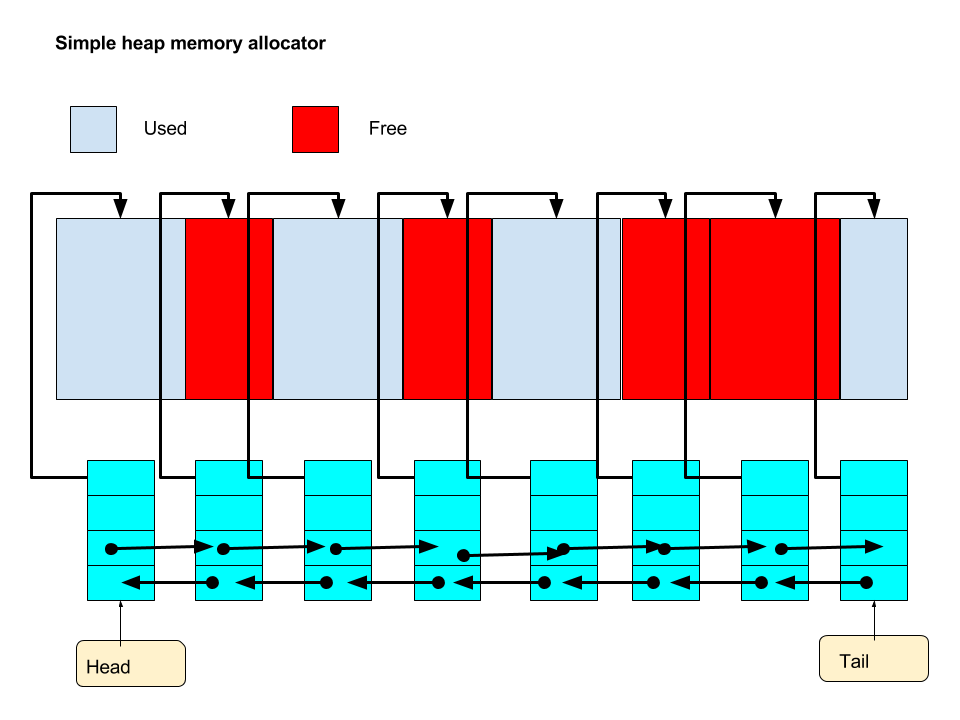
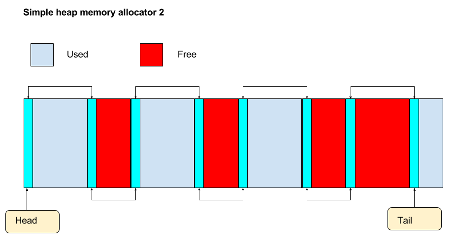

# Notes
## Random notes

## Simple heap memory allocator. 

The following diagram shows the basic design / data structures fo a simple heap allocator:



It helps to visualize the blocks (used and free) as separate from the nodes that manage the blocks (metadata). The nodes would contain a pointer to the block, the size of the block, whether the block is used or not, and a couple of pointers to allow the nodes to be hooked into a doubly linked list. A doubly linked list seems a bit complex, but there are points where you will need to check the previous and next blocks to see if they are free and can be coalesced with the current block. For example, if you have free, used, free blocks and then you free the used block you have free, free, free. These blocks can be colalsced inot one free block.  

Note that, in the diagram, a `free()` has meant that there are two contiguous free blocks that can be coalesced into one free block, thus helping to avoid memory fragmentation.

In a real implementation the nodes (metadata) will be part of the blocks, and not separate.

Basic node data structure would look something like (in dodgy pseudo-code):

```C
// node for managing a block
typedef node_s struct {
    block_ptr *b; // points to a memory block
    unsigned int size; // size of block, look into size_t
    boolean_t used; // used: true or false
    node_s *next;
    node_s *prev;	   
 } node_t;
```

This is not the most efficient data structure though, but serves to get a very basic design up and running.  

## malloc()

Simple case: You would walk along the linked-list checking for the first free block of suitable size. Unless the free block was of exactly the right size, it would then be split into an allocated block and a new free block in the list (with its new metadata). This requires you insert a new node (a free block) into the linked-list. This is basically the "first fit" approach.

## free()

Simple case: You are given the address of the block to free. In a real implementation the meta-data (node) associated with an allocated block would be part of the block itself. So given the address of the block to free we can quickly look up metadata for the block, set used to free, and coalesce any adjacent blocks, updating metadata as required.

## Blocks containing metadata

In practice the nodes for managing metadata would be part of the allocated block. This is shown in a modified version of the previous diagram:



Note that it is necessary to allocate larger than the requested block size - that is, you need to allocate block size plus node size. You no longer need to store the pointer to the block in a node. As you know the location of the node in memory, you can simply add a constant to it (the node size) to find the start point of the actual allocation. 

If you were doing a free() you would take the passed pointer and subtract the node size to get the start of the metadata.
